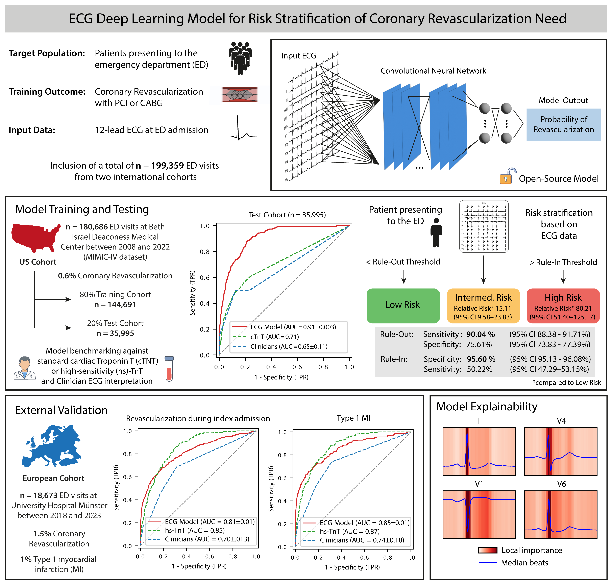

# REVASC: ECG Model for Risk Stratification of Coronary Revascularization Need in the Emergency Department


This repository accompanies the article **Deep Learning Electrocardiogram Model for Risk Stratification of 
Coronary Revascularization Need in the Emergency Department**. 
It provides code to reproduce the model training described in the paper, 
as well as to utilize the trained model weights for prediction and fine-tuning.



If you use this work, please cite the corresponding article listed in the Reference section below.


### Overview

Relevant code is provided across several Jupyter notebooks:
- *create_mimic_ecg_dataset.ipynb*: Includes routines for creating the study dataset using various PhysioNet sources.
- *create_mimic_ecgs_ml_training_view.ipynb*: Handles ECG signal preparation for model training.
- *model_training.ipynb*: Demonstrates the model training procedure.
- *model_evaluation_and_threshold.ipynb*: Evaluates model performance and includes routines for generating figures and determining thresholds.
- *demo_predictions.ipynb*: Provides example predictions on two ECG signals, representing low-risk and high-risk cases.

The models folder includes 10 trained .pkl files representing the ensemble model as described in the paper.

### Getting Started

Install the required dependencies using:

```
pip install -r requirements.txt
```

All necessary model weights are included in the repository. 
You can load and use the pretrained models with just a few lines of code:

```python
from revasc import Revasc

revasc = Revasc(cpu=True)
revasc.load(model_path="../models/revasc_mimic/")

# ecgs with shape (n_samples, 12 leads, 1000) - 10 seconds 100 HZ
revasc.predict_proba(ecgs)  # outputs probabilities
revasc.predict_risk(ecgs)   # outputs low, intermediate, and high risk
```

A complete working example is available in the notebook *notebooks/demo_prediction.ipynb*.

### Legal disclaimer

This software tool is intended solely for research and informational purposes. 
It is NOT a medical device and has NOT been approved or certified by any regulatory agency. 
The tool must NOT be used for clinical decision-making or patient management. 
Users are solely responsible for compliance with applicable laws and regulations. 
The authors and contributors accept no responsibility or liability for any damages or 
consequences arising from the use of this software.

### Reference

TBA
